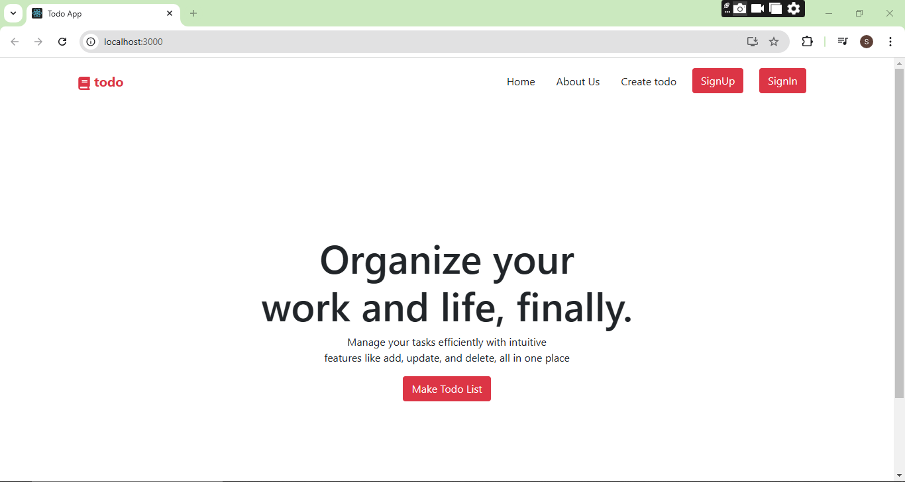
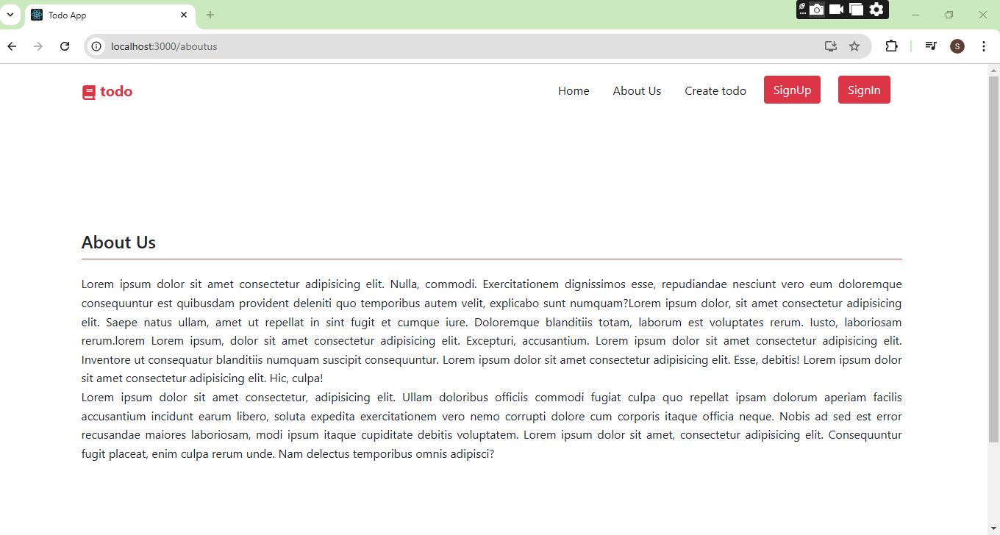
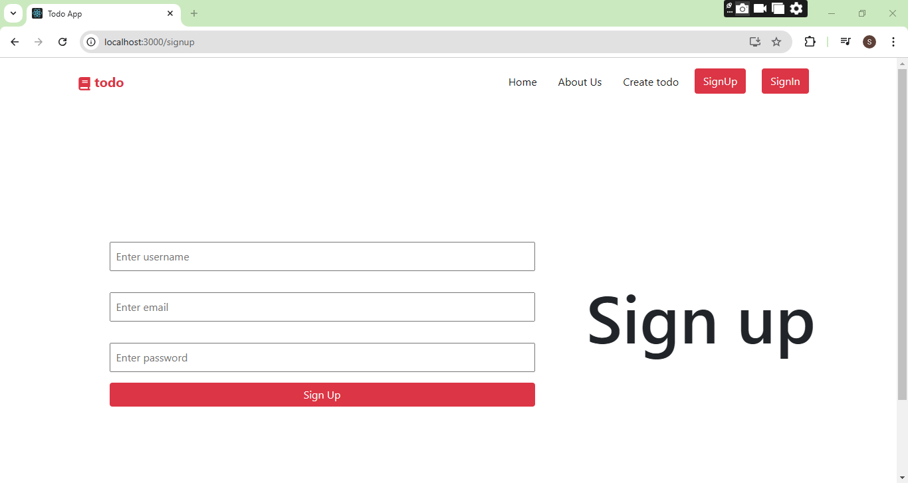
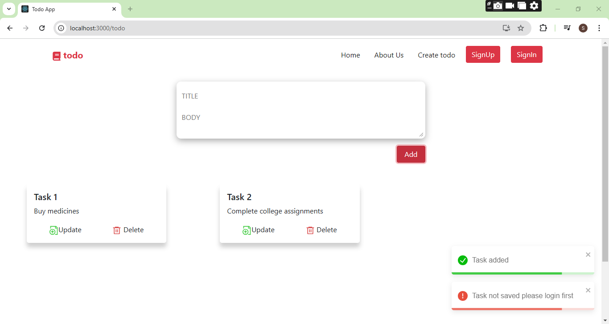
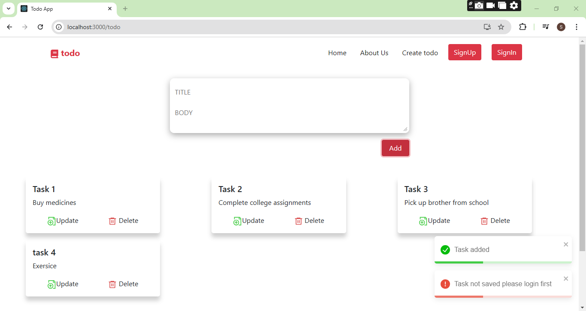
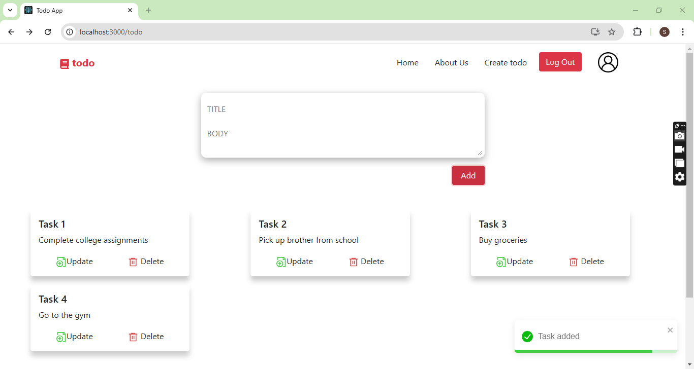
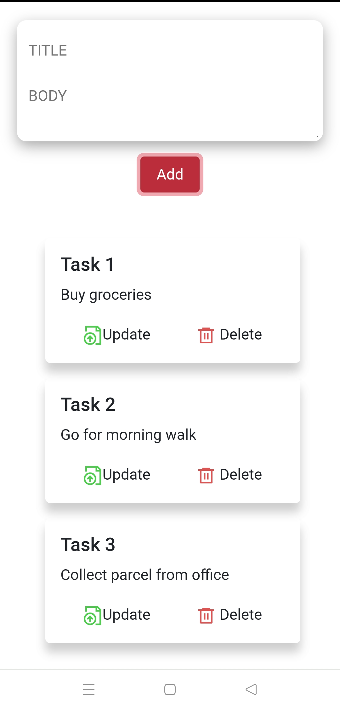
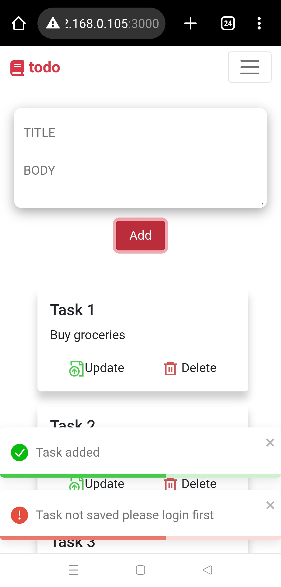
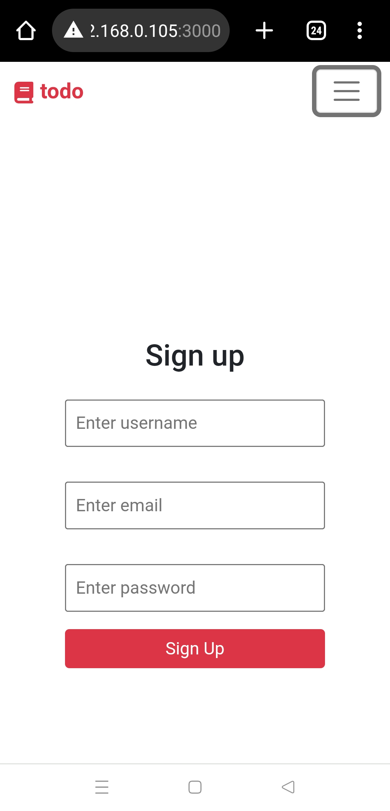
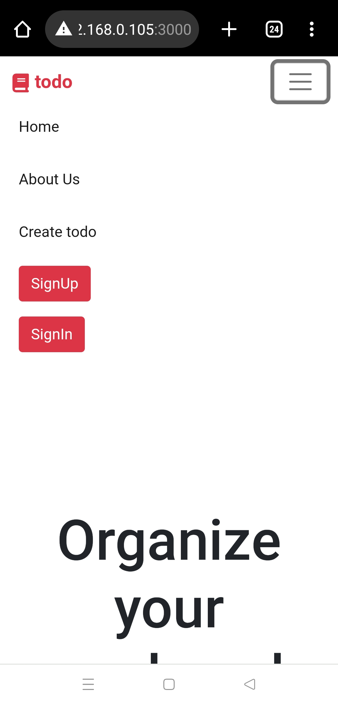

# Responsive Todo App

This is a responsive Todo application built using React and bootstrap css for the frontend, Express.js for the backend, and MongoDB for the database. It includes features such as:

- User authentication with login and signup functionality.
- Creating tasks even without logging in (tasks are saved only when logged in).
- CRUD operations: Users can add, update, and delete todos.
- A **responsive** design for seamless usage across devices.
- State management using **useContext** to track user login status.
- Backend powered by **RESTful** API/users.

## Tod App












## Features

- **Signup**: Create a new account.
- **Login**: Log in to access and save tasks.
- **Guest Mode**: Create tasks without logging in (won't persist).

## Todo Management

- Add new tasks.
- Edit existing tasks.
- Delete tasks.
- Tasks are saved and fetched from the MongoDB database when the user is logged in

## Tech Stack

- React
- CSS/Bootstrap
- Express.js
- MongoDB (NoSQL database)

## API/user Endpoints

- **POST /api/user/signup**: Create a new user.
- **POST /api/user/login**: Authenticate and log in a user.
- **GET /api/user/getTask/:user_id**: Get all todos for the logged-in user.
- **POST /api/user/addTask**: Add a new todo.
- **PUT /api/user/updateTask/:id**: Update an existing todo.
- **DELETE /api/user/deleteTask/:task_id**: Delete a todo.

## To run the backend
configure your mongodb setup in /db/connect.js

1. Navigate to the backend directory:
```bash
cd backend
```

2.Install node modules
```bash
npm install
```

3. Start the server
```bash
npm run dev
```
4. Ensure MongoDB is running on your system or connect to a MongoDB Atlas cluster.

## To run frontend

1. Navigate to 
```bash
cd to-do-app
```

2.Install node modules
```bash
npm install
```

3. Run react server
```bash
npm start
```
